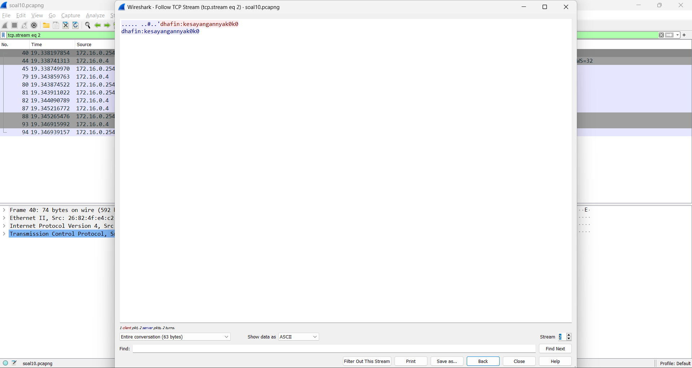

# Praktikum Jaringan Komputer 2023

**Kelompok IT08**

Nama Anggota Kelompok | NRP
------------------- | --------------		
Aqil Sulthan Yuki Maye | 5027211007
Adimas Defatra Bimasena Sulthantik M | 5027211040

## Modul 1

## Daftar Soal :
- [Soal 1](#soal-1)
- [Soal 2](#soal-2)
- [Soal 3](#soal-3)
- [Soal 4](#soal-4)
- [Soal 5](#soal-5)
- [Soal 6](#soal-6)
- [Soal 7](#soal-7)
- [Soal 8](#soal-8)
- [Soal 9](#soal-9)
- [Soal 10](#soal-10)

---
### Soal 1
User melakukan berbagai aktivitas dengan menggunakan protokol FTP. Salah satunya adalah mengunggah suatu file.

**a.** Berapakah sequence number (raw) pada packet yang menunjukkan aktivitas tersebut? 
- Penjelasan:
Aktivitas tersebut merujuk pada paket nomor `147` yang melakukan proses pengunggahan (STOR) sebuah file bernama `c75-GrabThePhisher.zip` melalui server FTP. Didapatkan sequence number (raw) dari paket tersebut yaitu `258040667`.

**b.** Berapakah acknowledge number (raw) pada packet yang menunjukkan aktivitas tersebut? 
- Penjelasan:
Didapatkan acknowledge number (raw) dari paket tersebut yaitu `1044861039`.

**c.** Berapakah sequence number (raw) pada packet yang menunjukkan response dari aktivitas tersebut?
- Penjelasan:
Response dari aktivitas tersebut merujuk pada paket nomor 149 yang telah berhasil membuka koneksi data dalam mode biner untuk mengirim atau menerima file `c75-GrabThePhisher.zip`. Didapatkan sequence number (raw) pada packet yang menunjukkan response dari paket tersebut yaitu `1044861039`.

**d.** Berapakah acknowledge number (raw) pada packet yang menunjukkan response dari aktivitas tersebut?
- Penjelasan: 
Didapatkan acknowledge number (raw) dari paket tersebut yaitu `258040696`.

---
### Soal 2
Sebutkan web server yang digunakan pada portal praktikum Jaringan Komputer!
- Penjelasan:
Web Server yang digunakan pada portal praktikum Jaringan Komputer adalah `gunicorn`. Kami menggunakan filter `http` untuk mendapatkan web server yang digunakan.

---
### Soal 3
Dapin sedang belajar analisis jaringan. Bantulah Dapin untuk mengerjakan soal berikut:

**a.** Berapa banyak paket yang tercapture dengan IP source maupun destination address adalah `239.255.255.250` dengan port `3702`? 
- Penjelasan:
Kami menggunakan display filter `(ip.src == 239.255.255.250 || ip.dst == 239.255.255.250) && udp.port == 3702`untuk mengcapture paket dengan IP source maupun destination address `239.255.255.250` dengan port `3702`. Jumlah paket yang tercapture dapat dilihat di bagian pojok kanan bawah. Didapatkan banyak paket yang tercapture sejumlah 21 paket.

**b.** Protokol layer transport apa yang digunakan?
- Penjelasan:
Dari filter yang dilakukan juga terlihat protokol layer transport yang digunakan, yaitu `UDP`.

---
### Soal 4
Berapa nilai checksum yang didapat dari header pada paket nomor `130`?
- Penjelasan:
Kami menggunakan display filter `frame.number == 130` supaya hanya menampilkan paket nomor `130`. Setelah itu, kami mengecek nagian User Datagram Protocol (UDP) di bagian detail untuk melihat nilai checksum header pada paket nomor `130`.

---
### Soal 5
Elshe menemukan suatu file packet capture yang menarik. Bantulah Elshe untuk menganalisis file packet capture tersebut.

**a.** Berapa banyak packet yang berhasil di capture dari file pcap tersebut?
- Penjelasan:
Jumlah paket yang berhasil dicapture dapat dilihat di bagian pojok kanan bawah. Didapatkan jumlah paket yang tercapture sejumlah 60 paket.

**b.** Port berapakah pada server yang digunakan untuk service SMTP? 
- Penjelasan:
Port yang digunakan untuk service SMTP (Simple Mail Transfer Protocol) pada file pcap adalah Port `25`.

**c.** Dari semua alamat IP yang tercapture, IP berapakah yang merupakan public IP?
- Penjelasan:
Berdasarkan alamat IP yang tercapture, alamat IP yang merupakan public IP adalah `74.53.140.153`. Alamat IP `192.168.x.x ` dan `10.10.1.4` merupakan alamat IP Private.

---
### Soal 6
Seorang anak bernama Udin Berteman dengan SlameT yang merupakan seorang penggemar film detektif. sebagai teman yang baik, Ia selalu mengajak slamet untuk bermain valoranT bersama. suatu malam, terjadi sebuah hal yang tak terdUga. ketika udin mereka membuka game tersebut, laptop udin menunjukkan sebuah field text dan Sebuah kode Invalid bertuliskan `"server SOURCE ADDRESS 7812 is invalid"`. ketika ditelusuri di google, hasil pencarian hanya menampilkan `a1 e5 u21`. jiwa detektif slamet pun bergejolak. bantulah udin dan slamet untuk menemukan solusi kode error tersebut.
- Penjelasan:
Kami melakukan display filter dengan kueri `frame.number == 7812` agar hanya menampilkan paket nomor 7812. Kemudian dari soal, terdapat sebuah hint tersembunyi yang didapatkan dari rangkaian huruf besar disoal, yaitu `"SUBSTITUSI"`. Dari hint tersebut, kami melakukan substitusi alamat IP source paket 7812 (`104.18.14.101`) ke huruf abjad, yaitu 10 subtitusi ke huruf menjadi J, 4 menjadi D, 18 menjadi R, 14 menjadi N, 10 menjadi J, dan 1 menjadi A. Sehingga didapat solusi kode error yaitu `"JDRNJA"` 

---
### Soal 7
Berapa jumlah packet yang menuju IP `184.87.193.88`?
- Penjelasan:
Kami menggunakan display filter `ip.dst == 184.87.193.88` untuk memfilter jumlah packet yang menuju IP `184.87.193.88`. Terdapat 6 packet yang menuju IP `184.87.193.88`.

---
### Soal 8
Berikan kueri filter sehingga wireshark hanya mengambil semua protokol paket yang menuju port `80`! (Jika terdapat lebih dari 1 port, maka urutkan sesuai dengan abjad)
- Penjelasan:
Untuk melakukan filter sehingga wireshark hanya mengambil semua protokol paket yang menuju port 80, kueri filter yang dapat digunakan yaitu `tcp.dstport == 80 || udp.dstport == 80`.
<!--  -->

---
### Soal 9
Berikan kueri filter sehingga wireshark hanya mengambil paket yang berasal dari alamat `10.51.40.1` tetapi tidak menuju ke alamat `10.39.55.34`!
- Penjelasan:
Untuk melakukan filter sehingga wireshark hanya mengambil paket yang berasal dari alamat `10.51.40.1` tetapi tidak menuju ke alamat `10.39.55.34`, kueri filter yang dapat digunakan yaitu `ip.src == 10.51.40.1 && ip.dst != 10.39.55.34`.
<!--  -->

---
### Soal 10
Sebutkan kredensial yang benar ketika user mencoba login menggunakan Telnet
- Penjelasan:
Pada file pcap yang telah diberikan, kami melakukan follow TCP stream pada paket dengan protokol `TELNET`. Ketika difollow, terdapat kredensial user dengan format `username:password`, lalu kami melakukan stream hingga menemui stream 15 yang merupakan kredensial yang benar ketika user mencoba login, yaitu `ddhhaaffiinn:kesayangannyak0k0`.
